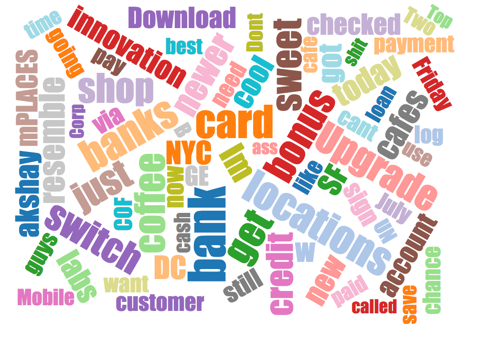

# Word Cloud Layout

This is a [Jason Davies](http://www.jasondavies.com/wordcloud/)-inspired word cloud layout.

See the samples in `examples/`.

## Usage:
`examples/wordcloud.html` uses sample data from `data/wordcloudtext.json`.
To test the word loud layout, modify the text under "content" in the JSON file.
Refer to [Jason Davies](https://github.com/jasondavies/d3-cloud) word cloud repo for complete API reference.
